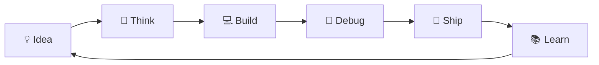

<!-- ====================================================== -->
<!--                    PREM | GITHUB                       -->
<!-- ====================================================== -->

<div align="center">


<br/>

<a href="https://github.com/Prem7105">

</a>

<a href="https://github.com/Prem7105?tab=followers">

</a>

<a href="https://github.com/Prem7105?tab=repositories">

</a>

<br/><br/>


</div>

---

<div align="center">

## ⚡ `whoami`

</div>

```python
class Developer:
    def __init__(self):
        self.name = "Prem"
        self.username = "Prem7105"

        self.focus = [
            "Software Development",
            "Machine Learning",
            "Backend Development",
            "Data Analytics"
        ]

        self.stack = [
            "Python",
            "Django",
            "JavaScript",
            "TypeScript",
            "SQL"
        ]

        self.status = "Building + Learning"

    def mindset(self):
        return "Learn → Build → Improve → Repeat"


prem = Developer()
print(prem.mindset())
```

<div align="center">

```text
> system boot complete

> developer     : Prem
> status        : ONLINE
> main weapon   : Python
> side quest    : Machine Learning
> current mode  : Building
> curiosity     : ∞
```

</div>

---

<div align="center">

# 🛠️ TECH ARSENAL

### Languages


<br/><br/>

### Backend & Databases


<br/><br/>

### Tools


<br/><br/>


</div>

---

<div align="center">

# 🎮 PLAYER PROFILE

```text
╔══════════════════════════════════════════════╗
║                PLAYER STATUS                 ║
╠══════════════════════════════════════════════╣
║                                              ║
║   PLAYER       : Prem                        ║
║   CLASS        : Developer                   ║
║   WEAPON       : Python                      ║
║   SKILL TREE   : Backend + ML + Data         ║
║   POWER-UP     : Curiosity                   ║
║   FINAL BOSS   : Bugs                        ║
║   XP           : Increasing Daily            ║
║                                              ║
╚══════════════════════════════════════════════╝
```

</div>

---

<div align="center">

# 🚀 PROJECT PORTAL

### `Choose your destination`

</div>

<table align="center">

<tr>
<td>📈</td>
<td><a href="https://github.com/Prem7105/MarketPulse"><b>MarketPulse</b></a></td>

<td>🌦️</td>
<td><a href="https://github.com/Prem7105/weathergpt"><b>WeatherGPT</b></a></td>
</tr>

<tr>
<td>❤️</td>
<td><a href="https://github.com/Prem7105/Heart-Risk-Prediction"><b>Heart Risk Prediction</b></a></td>

<td>🧠</td>
<td><a href="https://github.com/Prem7105/amazon-ml"><b>Amazon ML</b></a></td>
</tr>

<tr>
<td>🚗</td>
<td><a href="https://github.com/Prem7105/ford-car-price-prediction-linear-regression"><b>Ford Car Price Prediction</b></a></td>

<td>💰</td>
<td><a href="https://github.com/Prem7105/SpendWise"><b>SpendWise</b></a></td>
</tr>

<tr>
<td>🤖</td>
<td><a href="https://github.com/Prem7105/candidate-engine"><b>Candidate Engine</b></a></td>

<td>📡</td>
<td><a href="https://github.com/Prem7105/company-api-drf"><b>Company API DRF</b></a></td>
</tr>

<tr>
<td>🎓</td>
<td><a href="https://github.com/Prem7105/Predict-Placements"><b>Predict Placements</b></a></td>

<td>📊</td>
<td><a href="https://github.com/Prem7105/Insurance-EDA"><b>Insurance EDA</b></a></td>
</tr>

<tr>
<td>🫀</td>
<td><a href="https://github.com/Prem7105/Heart-Disease-EDA"><b>Heart Disease EDA</b></a></td>

<td>📉</td>
<td><a href="https://github.com/Prem7105/binance-testnet-trading-bot"><b>Trading Bot</b></a></td>
</tr>

<tr>
<td>🏧</td>
<td><a href="https://github.com/Prem7105/atm_verilog"><b>ATM Verilog</b></a></td>

<td>🎬</td>
<td><a href="https://github.com/Prem7105/Netflix-Data-Visualization"><b>Netflix Visualization</b></a></td>
</tr>

<tr>
<td>🌱</td>
<td><a href="https://github.com/Prem7105/Trust-Carbon"><b>Trust Carbon</b></a></td>

<td>🛡️</td>
<td><a href="https://github.com/Prem7105/Memory-Lane"><b>Memory Lane</b></a></td>
</tr>

<tr>
<td>🔗</td>
<td><a href="https://github.com/Prem7105/Nexus"><b>Nexus</b></a></td>

<td>🧠</td>
<td><a href="https://github.com/Prem7105/advisorsetu"><b>AdvisorSetu</b></a></td>
</tr>

</table>

<br/>

<div align="center">

<a href="https://github.com/Prem7105?tab=repositories">

</a>

</div>

---

<div align="center">

# 📊 GITHUB ANALYTICS


<br/>


<br/><br/>


</div>

---

<div align="center">

# 🎮 CONTRIBUTION GAME

### `PAC-MAN VS COMMITS`


</div>

---

<div align="center">

# 📈 ACTIVITY MATRIX


</div>

---

<div align="center">

# 🧠 SKILL TREE

</div>

```text
Prem.exe
│
├── 💻 Development
│   ├── Python
│   ├── JavaScript
│   ├── TypeScript
│   └── Git / GitHub
│
├── 🌐 Backend
│   ├── Django
│   ├── Django REST Framework
│   ├── REST APIs
│   └── SQL
│
├── 🤖 Machine Learning
│   ├── EDA
│   ├── Regression
│   ├── Classification
│   └── Model Evaluation
│
├── 📊 Data
│   ├── Pandas
│   ├── Visualization
│   └── Feature Engineering
│
└── ⚙️ Other
    ├── Verilog
    ├── Linux
    └── APIs
```

---

<div align="center">

# 🔄 DEVELOPMENT LOOP



</div>

---

<div align="center">

# 🛰️ DEV SIGNAL

```text
┌──────────────────────────────────────────────┐
│                                              │
│   SYSTEM        ● ONLINE                     │
│                                              │
│   BUILDING      ████████████████████         │
│   LEARNING      ████████████████████         │
│   IMPROVING     ████████████████████         │
│   CURIOSITY     ████████████████████  ∞      │
│                                              │
└──────────────────────────────────────────────┘
```

</div>

---

<div align="center">

# 💭 PHILOSOPHY

### `LEARN → BUILD → DEBUG → IMPROVE → REPEAT`

<br/>


</div>

---

<div align="center">

# 🤝 CONNECT

<a href="https://github.com/Prem7105">

</a>

<br/><br/>


<br/>

### `while(alive) { learn(); build(); improve(); }`

<br/>


</div>
